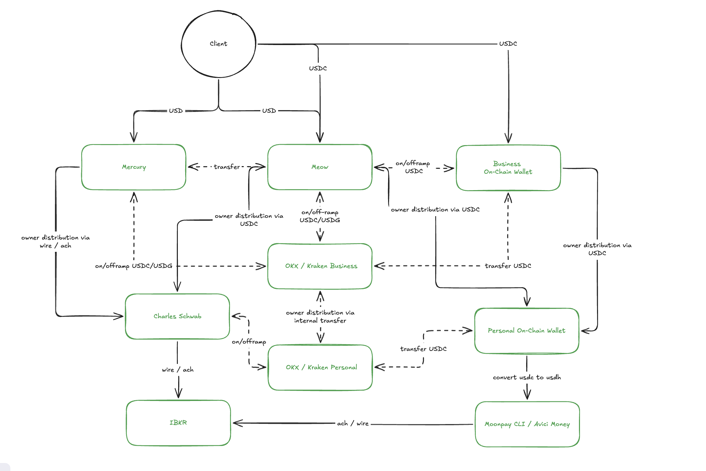

# Wyoming Series LLC

Formed via [Otoco](https://otoco.io). High privacy, no public member registry. Non-resident / foreign-resident friendly.

**Tested profiles:** Paraguay, Cayman Islands, Palau residency

## Why Wyoming over Delaware

| | Wyoming | Delaware |
|---|---|---|
| Privacy | High — no public member registry | Lower — registered agent required |
| Annual cost | ~$100 (Otoco) | Higher |
| Series LLC | ✅ | ✅ |
| Best for | Privacy-first, lean operators | VC-backed, institutional |

## Fund Flow

**High-level path:**

1. **Inbound** — Clients pay via wire/ACH (USD) or directly on-chain (USDC)
2. **Business banking** — USD lands in Mercury/Meow; Meow is the central hub for USDC on/off-ramp and owner distributions
3. **On-chain treasury** — USDC held in Business On-Chain Wallet; managed via CEX or direct transfer
4. **Distribution** — Owner distributions flow from business accounts → personal exchange (OKX/Kraken) → Personal On-Chain Wallet, brokerage (Charles Schwab, IBRK), or local fintech (Monoapp CLI / Ariel Money)

> Personal accounts in step 4 are residency-dependent. This diagram reflects a US LLC + Paraguay residency setup, but the business layer works the same regardless of where you live.

For KYB providers, see [US LLC →](../)
