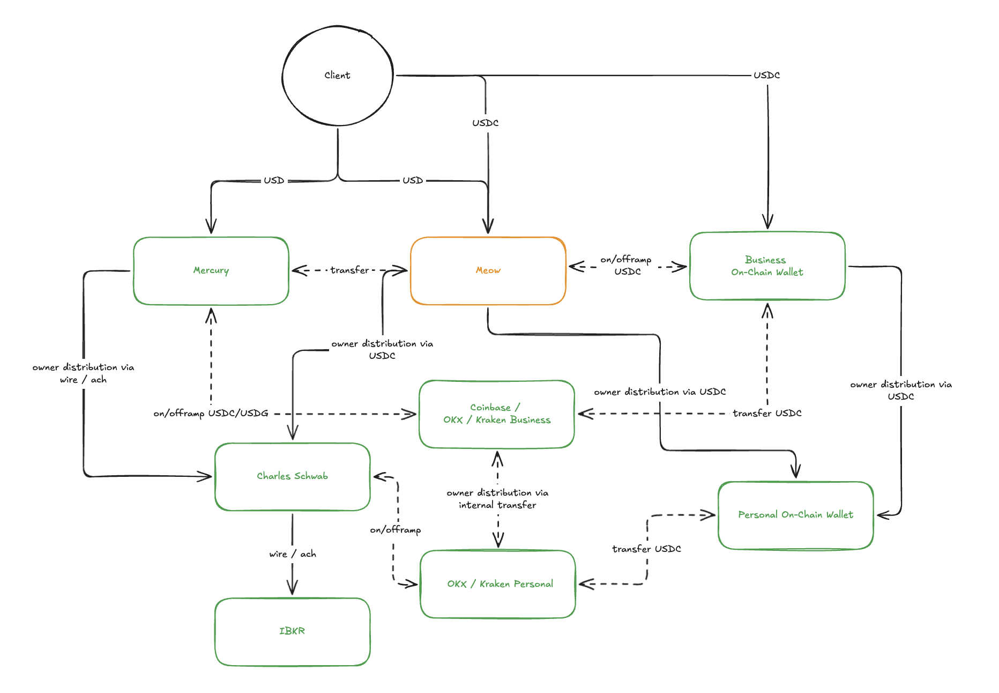

# Wyoming Series LLC

Entity created via [Otoco](https://otoco.io). Non-resident / foreign-resident friendly.

**Tested profiles:** US Wyoming Series LLC with residency from Paraguay, Cayman Islands, and Palau

## Fund Flow

**High-level path:**

1. **Inbound** — Clients pay via wire/ACH (USD) or directly on-chain (USDC)
2. **Business banking** — USD lands in Novo; on/off-ramp to USDC as needed
3. **On-chain treasury** — USDC held in Business On-Chain Wallet; managed via CEX or direct transfer
4. **Distribution** — Owner distributions flow from business accounts → personal exchange → Personal On-Chain Wallet (or fiat via brokerage)

## Providers

### ✅ Accepted

| Provider | Type | Notes |
|---|---|---|
| Mercury | Business Banking | Main business account. USD wire/ACH + USDC on/off-ramp |
| Kraken Business | Crypto Exchange | — |
| OKX Business | Crypto Exchange | — |

### 🔄 In Progress

| Provider | Type | Notes |
|---|---|---|
| Meow | Business Banking | — |

### ❌ Rejected

| Provider | Type | Reason |
|---|---|---|
| Altitude | Business Banking | Not disclosed |
| Paxos | Stablecoin / Payments | High risk |
| Brex | Business Banking | VC-backed entity required |
| Coinbase | Crypto Exchange | State filing required |

> PRs welcome — if you've tested this entity type with a provider not listed, add your outcome and residency profile.

## Notes

- KYB approval depends heavily on how the application is structured, not just entity type or residency
- Tested across three residency profiles: Paraguay, Cayman Islands, Palau
- Ongoing maintenance is minimal once the stack is set up
